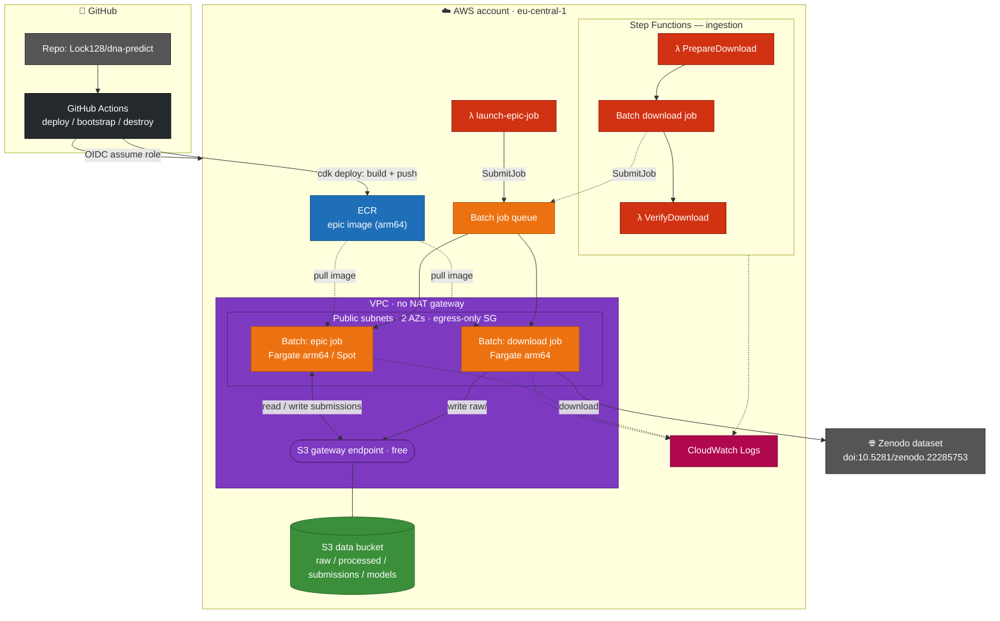
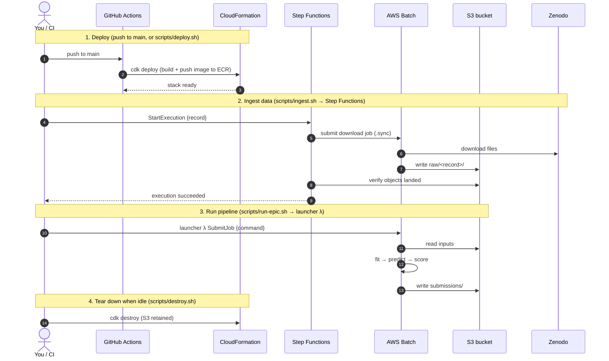

# AWS Action Plan

The EPIC data (five genomes + strand-separated, single-nucleotide, two-replicate
csRNA-seq tracks) is too large to work with comfortably on a laptop. This
document is our action plan for running the workloads on AWS: what we'd do, in
what order, why, and roughly what it costs.

The guiding principle: **cheapest thing that works, scale up only for the job
that needs it.** Storage is always-on and cheap; compute is spun up per job and
stopped immediately after.

---

## 0. Prerequisites (one-time)

- [ ] An AWS account (personal or team). Enable MFA on the root user; create an
      IAM user/role for day-to-day work rather than using root.
- [ ] Install the AWS CLI locally and `aws configure` with an access key (or SSO).
- [ ] Pick a region close to us and stick to it (e.g. `eu-central-1` Frankfurt
      or `us-west-2`). Keeping storage + compute in the **same region** avoids
      cross-region data-transfer charges.
- [ ] Set a **billing alarm** (AWS Budgets) so a forgotten instance can't run up
      a surprise bill. Suggested: alert at $20 and $50/month.

---

## 1. Storage — S3 as the data hub

**Why:** S3 is cheap at rest (~$0.023/GB/month in most regions), durable, and is
the natural place every compute option reads from. Download the Zenodo release
**once**, land it in S3, and never re-download to a laptop.

Action:

- [ ] Create a bucket, e.g. `s3://epic-dna-predict/` (bucket names are global —
      pick something unique). Keep it **private**.
- [ ] Layout:
  ```
  s3://epic-dna-predict/
    raw/            # exactly as downloaded from Zenodo (immutable)
      nematostella/
      oyster/
      octopus/
      moth/
      milkweed-bug/
      dogfish/
    processed/      # our derived intermediates (indexed, filtered, etc.)
    submissions/    # generated submission TSVs
    models/         # trained model artifacts
  ```
- [ ] Get the data into S3. Two options:
  - Download to an EC2 instance (fast, in-cloud) then `aws s3 sync`. **Preferred**
    — Zenodo → EC2 → S3 stays in AWS's network and avoids saturating home
    bandwidth.
  - Or download locally and `aws s3 cp --recursive` up (only if the files are
    small enough to be practical).
- [ ] Turn on **S3 versioning** on `raw/` so the pristine data can't be
      clobbered. Consider a lifecycle rule to move `raw/` to
      **S3 Infrequent-Access** or **Glacier** after we've processed it, to cut
      storage cost.

**Estimated cost:** if the full dataset is ~200 GB, that's ~$5/month in Standard
S3, less in IA/Glacier.

---

## 2. Compute (baseline + data wrangling) — one start/stop EC2 instance

**Why:** the dinucleotide baseline and all the FASTA/bedGraph parsing is
CPU/memory/IO-bound, not GPU work. A single memory-optimized instance that we
**start when working and stop when done** is the cheapest capable option. Our
Rust binary is a single static file, so there's no environment setup on the box.

Action:

- [ ] Launch a memory-optimized **Graviton (ARM)** instance — e.g. `r7g.xlarge`
      (4 vCPU / 32 GB) or `r7g.2xlarge` (8 vCPU / 64 GB) if we hold whole
      chromosomes in RAM. Graviton is cheaper per vCPU and our Rust code
      cross-compiles to `aarch64` cleanly.
- [ ] Attach a generous **EBS gp3** volume (e.g. 300–500 GB) as scratch for the
      genomes and tracks pulled from S3.
- [ ] Give the instance an **IAM role** granting read/write to our bucket — no
      access keys on the box.
- [ ] Workflow per session:
  1. `aws s3 sync s3://epic-dna-predict/raw/<species> ./data/` (or stream
     directly from S3 where the tool supports it).
  2. Run the Rust binary: fit baseline → predict → write submission.
  3. `aws s3 cp submission.tsv s3://epic-dna-predict/submissions/`.
  4. **Stop the instance.** (Stop, not terminate — keeps the EBS volume and our
     setup; you only pay for EBS storage while stopped.)

**Estimated cost:** `r7g.2xlarge` ≈ $0.40/hr on-demand — a few dollars per
working session. Stopped instance ≈ only EBS (~$0.08/GB/month for gp3).

**Cheaper still:** use **Spot instances** for long batch runs (up to ~70% off)
since the baseline is restartable.

---

## 3. Scaling up — only when we train real models

The baseline needs no GPU. When we move to a sequence CNN or use pretrained
genomic models (AlphaGenome, Evo 2), scale the compute up **for that job only**:

- [ ] **GPU EC2** — `g5.xlarge` (1× A10G) for prototyping, `g6`/`p4`/`p5` for
      heavier training. Same start/stop discipline; use Spot for tolerant jobs.
- [ ] **or Amazon SageMaker** — managed training jobs that spin up, run, and tear
      down automatically, reading data from S3. Good when we want reproducible,
      fire-and-forget training runs without babysitting an instance.
- [ ] Store checkpoints/artifacts in `s3://epic-dna-predict/models/`.

**Note on the rules:** EPIC allows only the provided genome sequence as input,
with pretrained genomic models (AlphaGenome, Evo 2) as the sole exception. Keep
that constraint in mind when choosing what to run on the GPU boxes.

---

## 4. Optional: batch / automation

Once the pipeline is stable and we want to process all five species
hands-off:

- [ ] **AWS Batch** or a simple **EC2 + user-data script** that: pulls a species
      from S3, runs the Rust binary, uploads the submission, and shuts itself
      down. Turns "a working session" into "submit a job."
- [ ] Package the Rust binary in a small **container image** (ECR) if we go the
      Batch/Fargate route, so the runtime is pinned and reproducible.

---

## 5. Cost & hygiene checklist

- [ ] Billing alarm set (step 0).
- [ ] Instances **stopped or terminated** after every session — the #1 source of
      wasted spend.
- [ ] `raw/` data versioned and moved to cheaper storage class once processed.
- [ ] IAM roles instead of long-lived access keys on instances.
- [ ] Everything (bucket + compute) in **one region**.
- [ ] Nothing large committed to git — raw data lives only in S3 (see
      `.gitignore`).

---

## Quick-reference commands

```bash
# One-time: create the bucket (choose your region)
aws s3 mb s3://epic-dna-predict --region eu-central-1

# Push the Zenodo download into S3 (run from wherever the data landed)
aws s3 sync ./epic-download s3://epic-dna-predict/raw/

# On the EC2 box: pull one species to local scratch
aws s3 sync s3://epic-dna-predict/raw/nematostella ./data/nematostella

# ... run the Rust baseline ...

# Push results back and stop the box
aws s3 cp submission.tsv s3://epic-dna-predict/submissions/nematostella.tsv
sudo shutdown -h now   # or: aws ec2 stop-instances --instance-ids <id>
```

---

## Infrastructure as code (CDK)

The manual steps above are the mental model. The actual resources are defined as
a CDK app in [`infra/`](../infra) so the whole setup is reproducible and
deployable via CI/CD — see [`infra/README.md`](../infra/README.md). It provisions:

- the **S3 data bucket** (the hub from step 1),
- the **container image** (built from the repo `Dockerfile`, ARM64, pushed to ECR),
- an **AWS Batch** Graviton/Fargate (Spot) compute environment + queue + job
  definitions, running in **public subnets with an egress-only security group**
  and a **free S3 gateway endpoint** — deliberately **no NAT gateway**, so idle
  cost is ~$0,
- a **Step Functions + Lambda** ingestion workflow that downloads the Zenodo
  dataset into S3 automatically (a Batch download job does the heavy transfer),
- a **launcher Lambda** to trigger `epic` container runs on Batch, and
- a **GitHub Actions** CI/CD workflow that deploys on push to `main` via an
  OIDC deploy role (no stored AWS keys).

**Idle cost:** because there is no NAT gateway and Batch/Lambda/Step Functions
are all pay-per-use, a deployed-but-unused stack costs essentially nothing — you
pay only for S3 storage (empty until ingestion runs), the ECR image (a few
cents), and any logs. Compute is billed only while a Batch job actually runs.

Once deployed: start the ingestion state machine to load the data, then invoke
the launcher (or `aws batch submit-job`) to run the pipeline.

### Architecture

Colors group resources by type: 🟠 compute (Batch), 🔴 serverless (Lambda /
Step Functions), 🟢 storage (S3), 🟣 network (VPC / endpoints), 🔵 registry
(ECR), 🩷 observability (logs), ⚫ CI/CD & external.



### When & how each part is invoked

The sequence below shows the lifecycle end to end; the table maps each action to
its trigger and the `scripts/` / npm command that runs it.



| # | Action | When | How to invoke |
|---|---|---|---|
| — | **Bootstrap** the account/region (one-time) | Before the first deploy | `scripts/bootstrap.sh` / `npm run aws:bootstrap`, or the **CDK bootstrap** workflow |
| 1 | **Deploy / update** infra + image | On every push to `main`; or manually | automatic via GitHub Actions; or `scripts/deploy.sh` / `npm run aws:deploy` |
| 2 | **Ingest** the Zenodo dataset into S3 | Once per dataset (or when it changes) | `scripts/ingest.sh [record]` / `npm run aws:ingest` — starts the Step Functions state machine |
| 3 | **Run** an `epic` job (baseline / predict / score) | Whenever you want a run | `scripts/run-epic.sh -- <epic args>` / `npm run aws:run` — invokes the launcher Lambda |
| — | **Watch** job logs | While a job runs | `scripts/logs.sh` / `npm run aws:logs` |
| — | **List** stack outputs | Anytime | `scripts/outputs.sh` / `npm run aws:outputs` |
| 4 | **Destroy** the stack | When idle, to guarantee $0 | `scripts/destroy.sh` / `npm run aws:destroy`, or the **Destroy** workflow (manual) |

All scripts read the region from `AWS_REGION` (default `eu-central-1`) and
resolve resource names from the CloudFormation stack outputs, so you don't have
to copy ARNs around. They assume your shell has AWS credentials (SSO or an
assumed role).

**Reading the architecture diagram:** CI/CD (GitHub Actions) assumes an existing
role via OIDC and runs `cdk deploy`, which builds the ARM64 image and pushes it
to ECR. At runtime the ingestion state machine downloads the Zenodo dataset into
S3 (via a Batch download job), and the launcher Lambda submits `epic` jobs to
the queue. Batch tasks run on Fargate ARM64 in **public subnets with public IPs
but an egress-only security group** (no inbound), and reach S3 through a free
gateway endpoint — so there is **no NAT gateway** and effectively no idle cost.

## Summary / decision

- **Start with:** S3 for storage + one start/stop Graviton EC2 box for the
  baseline. Cheap, simple, no GPU needed.
- **Scale to:** GPU EC2 or SageMaker only when training real/pretrained models.
- **Automate later:** AWS Batch once the pipeline is proven, if we want
  fire-and-forget runs across all five species.

This keeps spend to a few dollars for the baseline phase and defers the
expensive GPU compute until we actually need it.
