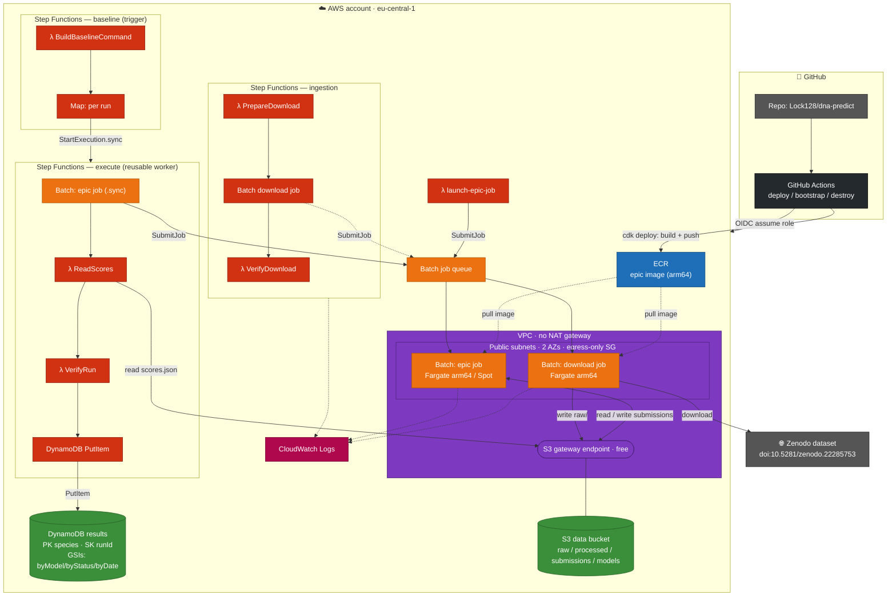
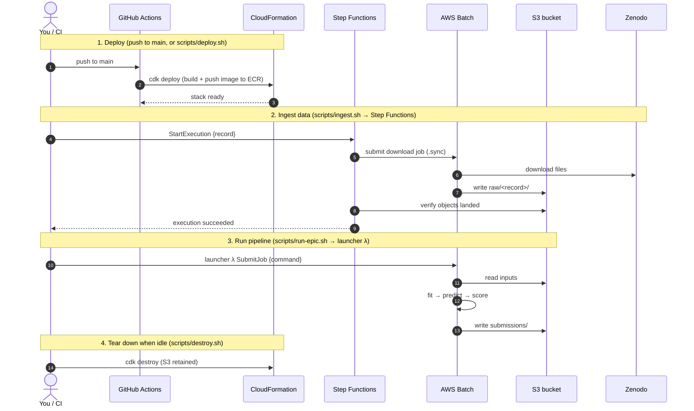

# AWS Action Plan

The EPIC data (five genomes + strand-separated, single-nucleotide, two-replicate
csRNA-seq tracks) is too large to work with comfortably on a laptop. This
document is our action plan for running the workloads on AWS: what we'd do, in
what order, why, and roughly what it costs.

The guiding principle: **cheapest thing that works, scale up only for the job
that needs it.** Storage is always-on and cheap; compute is spun up per job and
stopped immediately after.

---

## 0. Prerequisites (one-time)

- [ ] An AWS account (personal or team). Enable MFA on the root user; create an
      IAM user/role for day-to-day work rather than using root.
- [ ] Install the AWS CLI locally and `aws configure` with an access key (or SSO).
- [ ] Pick a region close to us and stick to it (e.g. `eu-central-1` Frankfurt
      or `us-west-2`). Keeping storage + compute in the **same region** avoids
      cross-region data-transfer charges.
- [ ] Set a **billing alarm** (AWS Budgets) so a forgotten instance can't run up
      a surprise bill. Suggested: alert at $20 and $50/month.

---

## 1. Storage — S3 as the data hub

**Why:** S3 is cheap at rest (~$0.023/GB/month in most regions), durable, and is
the natural place every compute option reads from. Download the Zenodo release
**once**, land it in S3, and never re-download to a laptop.

Action:

- [ ] Create a bucket, e.g. `s3://epic-dna-predict/` (bucket names are global —
      pick something unique). Keep it **private**.
- [ ] Layout:
  ```
  s3://epic-dna-predict/
    raw/            # exactly as downloaded from Zenodo (immutable)
      nematostella/
      oyster/
      octopus/
      moth/
      milkweed-bug/
      dogfish/
    processed/      # our derived intermediates (indexed, filtered, etc.)
    submissions/    # generated submission TSVs
    models/         # trained model artifacts
  ```
- [ ] Get the data into S3. Two options:
  - Download to an EC2 instance (fast, in-cloud) then `aws s3 sync`. **Preferred**
    — Zenodo → EC2 → S3 stays in AWS's network and avoids saturating home
    bandwidth.
  - Or download locally and `aws s3 cp --recursive` up (only if the files are
    small enough to be practical).
- [ ] Turn on **S3 versioning** on `raw/` so the pristine data can't be
      clobbered. Consider a lifecycle rule to move `raw/` to
      **S3 Infrequent-Access** or **Glacier** after we've processed it, to cut
      storage cost.

**Estimated cost:** if the full dataset is ~200 GB, that's ~$5/month in Standard
S3, less in IA/Glacier.

---

## 2. Compute (baseline + data wrangling) — one start/stop EC2 instance

**Why:** the dinucleotide baseline and all the FASTA/bedGraph parsing is
CPU/memory/IO-bound, not GPU work. A single memory-optimized instance that we
**start when working and stop when done** is the cheapest capable option. Our
Rust binary is a single static file, so there's no environment setup on the box.

Action:

- [ ] Launch a memory-optimized **Graviton (ARM)** instance — e.g. `r7g.xlarge`
      (4 vCPU / 32 GB) or `r7g.2xlarge` (8 vCPU / 64 GB) if we hold whole
      chromosomes in RAM. Graviton is cheaper per vCPU and our Rust code
      cross-compiles to `aarch64` cleanly.
- [ ] Attach a generous **EBS gp3** volume (e.g. 300–500 GB) as scratch for the
      genomes and tracks pulled from S3.
- [ ] Give the instance an **IAM role** granting read/write to our bucket — no
      access keys on the box.
- [ ] Workflow per session:
  1. `aws s3 sync s3://epic-dna-predict/raw/<species> ./data/` (or stream
     directly from S3 where the tool supports it).
  2. Run the Rust binary: fit baseline → predict → write submission.
  3. `aws s3 cp submission.tsv s3://epic-dna-predict/submissions/`.
  4. **Stop the instance.** (Stop, not terminate — keeps the EBS volume and our
     setup; you only pay for EBS storage while stopped.)

**Estimated cost:** `r7g.2xlarge` ≈ $0.40/hr on-demand — a few dollars per
working session. Stopped instance ≈ only EBS (~$0.08/GB/month for gp3).

**Cheaper still:** use **Spot instances** for long batch runs (up to ~70% off)
since the baseline is restartable.

---

## 3. Scaling up — only when we train real models

The baseline needs no GPU. When we move to a sequence CNN or use pretrained
genomic models (AlphaGenome, Evo 2), scale the compute up **for that job only**:

- [ ] **GPU EC2** — `g5.xlarge` (1× A10G) for prototyping, `g6`/`p4`/`p5` for
      heavier training. Same start/stop discipline; use Spot for tolerant jobs.
- [ ] **or Amazon SageMaker** — managed training jobs that spin up, run, and tear
      down automatically, reading data from S3. Good when we want reproducible,
      fire-and-forget training runs without babysitting an instance.
- [ ] Store checkpoints/artifacts in `s3://epic-dna-predict/models/`.

**Note on the rules:** EPIC allows only the provided genome sequence as input,
with pretrained genomic models (AlphaGenome, Evo 2) as the sole exception. Keep
that constraint in mind when choosing what to run on the GPU boxes.

---

## 4. Optional: batch / automation

Once the pipeline is stable and we want to process all five species
hands-off:

- [ ] **AWS Batch** or a simple **EC2 + user-data script** that: pulls a species
      from S3, runs the Rust binary, uploads the submission, and shuts itself
      down. Turns "a working session" into "submit a job."
- [ ] Package the Rust binary in a small **container image** (ECR) if we go the
      Batch/Fargate route, so the runtime is pinned and reproducible.

---

## 5. Cost & hygiene checklist

- [ ] Billing alarm set (step 0).
- [ ] Instances **stopped or terminated** after every session — the #1 source of
      wasted spend.
- [ ] `raw/` data versioned and moved to cheaper storage class once processed.
- [ ] IAM roles instead of long-lived access keys on instances.
- [ ] Everything (bucket + compute) in **one region**.
- [ ] Nothing large committed to git — raw data lives only in S3 (see
      `.gitignore`).

---

## Quick-reference commands

```bash
# One-time: create the bucket (choose your region)
aws s3 mb s3://epic-dna-predict --region eu-central-1

# Push the Zenodo download into S3 (run from wherever the data landed)
aws s3 sync ./epic-download s3://epic-dna-predict/raw/

# On the EC2 box: pull one species to local scratch
aws s3 sync s3://epic-dna-predict/raw/nematostella ./data/nematostella

# ... run the Rust baseline ...

# Push results back and stop the box
aws s3 cp submission.tsv s3://epic-dna-predict/submissions/nematostella.tsv
sudo shutdown -h now   # or: aws ec2 stop-instances --instance-ids <id>
```

---

## Infrastructure as code (CDK)

The manual steps above are the mental model. The actual resources are defined as
a CDK app in [`infra/`](../infra) so the whole setup is reproducible and
deployable via CI/CD — see [`infra/README.md`](../infra/README.md). It provisions:

- the **S3 data bucket** (the hub from step 1),
- the **container image** (built from the repo `Dockerfile`, ARM64, pushed to ECR),
- an **AWS Batch** Graviton/Fargate (Spot) compute environment + queue + job
  definitions, running in **public subnets with an egress-only security group**
  and a **free S3 gateway endpoint** — deliberately **no NAT gateway**, so idle
  cost is ~$0,
- a **Step Functions + Lambda** ingestion workflow that downloads the Zenodo
  dataset into S3 automatically (a Batch download job does the heavy transfer),
- a **launcher Lambda** to trigger `epic` container runs on Batch, and
- a **GitHub Actions** CI/CD workflow that deploys on push to `main` via an
  OIDC deploy role (no stored AWS keys).

**Idle cost:** because there is no NAT gateway and Batch/Lambda/Step Functions
are all pay-per-use, a deployed-but-unused stack costs essentially nothing — you
pay only for S3 storage (empty until ingestion runs), the ECR image (a few
cents), and any logs. Compute is billed only while a Batch job actually runs.

Once deployed: start the ingestion state machine to load the data, then invoke
the launcher (or `aws batch submit-job`) to run the pipeline.

### Architecture

Colors group resources by type: 🟠 compute (Batch), 🔴 serverless (Lambda /
Step Functions), 🟢 storage (S3), 🟣 network (VPC / endpoints), 🔵 registry
(ECR), 🩷 observability (logs), ⚫ CI/CD & external.



### When & how each part is invoked

The sequence below shows the lifecycle end to end; the table maps each action to
its trigger and the `scripts/` / npm command that runs it.



| # | Action | When | How to invoke |
|---|---|---|---|
| — | **Bootstrap** the account/region (one-time) | Before the first deploy | `scripts/bootstrap.sh` / `npm run aws:bootstrap`, or the **CDK bootstrap** workflow |
| 1 | **Deploy / update** infra + image | On every push to `main`; or manually | automatic via GitHub Actions; or `scripts/deploy.sh` / `npm run aws:deploy` |
| 2 | **Ingest** the Zenodo dataset into S3 | Once per dataset (or when it changes) | `scripts/ingest.sh [record]` / `npm run aws:ingest` — starts the Step Functions state machine |
| 3 | **Run the baseline** (reproducible, recorded) | Whenever you want a scored run | `scripts/run-baseline.sh --species NAME` / `npm run aws:baseline` — starts the `epic-baseline` state machine (or the **console**, see below) |
| 3b | **Run** an ad hoc `epic` job | One-off command / debugging | `scripts/run-epic.sh -- <epic args>` / `npm run aws:run` — invokes the launcher Lambda (not recorded) |
| — | **Watch** job logs | While a job runs | `scripts/logs.sh` / `npm run aws:logs` |
| — | **List** stack outputs | Anytime | `scripts/outputs.sh` / `npm run aws:outputs` |
| 4 | **Destroy** the stack | When idle, to guarantee $0 | `scripts/destroy.sh` / `npm run aws:destroy`, or the **Destroy** workflow (manual) |

All scripts read the region from `AWS_REGION` (default `eu-central-1`) and
resolve resource names from the CloudFormation stack outputs, so you don't have
to copy ARNs around. They assume your shell has AWS credentials (SSO or an
assumed role).

**Reading the architecture diagram:** CI/CD (GitHub Actions) assumes an existing
role via OIDC and runs `cdk deploy`, which builds the ARM64 image and pushes it
to ECR. At runtime the ingestion state machine downloads the Zenodo dataset into
S3 (via a Batch download job), and the launcher Lambda submits `epic` jobs to
the queue. Batch tasks run on Fargate ARM64 in **public subnets with public IPs
but an egress-only security group** (no inbound), and reach S3 through a free
gateway endpoint — so there is **no NAT gateway** and effectively no idle cost.

## Running the baseline from the AWS Console

You don't need the CLI or the wrapper scripts — the baseline is a Step Functions
state machine, so you can trigger it from the console with a small JSON input.
The scripts just resolve the ARN for you; the console does the same thing with a
form.

**Prerequisite:** the stack is deployed (`npm run aws:deploy` or a push to
`main`) and the data is in S3 (`scripts/ingest.sh`, or the ingestion state
machine — see below). Console triggering only works once these resources exist.

### Trigger a run

1. Sign in to the AWS Console and select your region (**eu-central-1** by
   default — top-right region picker).
2. Go to **Step Functions** → **State machines**.
3. Open **`epic-baseline`** (the outer machine — the one you trigger).
4. Click **Start execution**.
5. In **Input**, paste one of:
   - `{ "species": "nematostella" }` — a single species
   - `{ "species": "oyster", "k": 3 }` — override the k-mer size
   - `{ "species": "all" }` — fan out over every configured species in parallel
   
   (`species` must match a `config/<species>.json`; `k` is optional, default 2.)
6. Click **Start execution**.

The graph view opens. The `Map` state fans out to one child **`epic-execute`**
execution per species; each child runs the Batch job (`.sync`), reads the run's
`scores.json` from S3, verifies it, and writes a row to DynamoDB. Click a `Map`
iteration (or find the child in the `epic-execute` machine's **Executions** tab)
to drill into a single run.

### See the results

- **Scores + verification (DynamoDB):** **DynamoDB** → **Tables** →
  **`epic-results`** → **Explore table items**. Query by the partition key
  `species` (e.g. `nematostella`) to get that species' runs; each item has
  `auprc`, `spearman`, `verificationStatus`, `verificationDetail`,
  `submissionKey`, `finishedAt`, and more. The **byStatus** index (query
  `verificationStatus = FAILED`) is a quick way to find bad runs; **byModel**
  and **byDate** are there for "all runs of a model" and the global timeline.
- **The submission file (S3):** **S3** → the data bucket (output
  `DataBucketName`) → `submissions/<species>/` → `*.baseline.tsv` and
  `scores.json`.
- **Job logs:** **CloudWatch** → **Log groups** → **`/aws/batch/epic`** (or use
  `scripts/logs.sh`).

### Ingesting data from the console

Same idea for loading the data: **Step Functions** → **`epic-ingestion`** →
**Start execution** with `{ "record": "22285753" }`. It downloads the Zenodo
record into `s3://<bucket>/raw/<record>/` via a Batch job and verifies it landed.

### Finding the ARNs / names

Everything above is named with the `epic-` prefix. If you need exact ARNs
(e.g. for EventBridge or an API trigger later), they're **CloudFormation stack
outputs**: **CloudFormation** → **`epic-app`** → **Outputs** →
`BaselineStateMachineArn`, `ExecuteStateMachineArn`, `ResultsTableName`,
`DataBucketName` (or run `npm run aws:outputs`).

## Solving the EPIC challenge on this infrastructure

This ties the infrastructure back to the actual challenge (see
[`PROBLEM.md`](../PROBLEM.md)). EPIC gives us the initiation signal for
**80–95% of each genome** (the *train* contigs) and asks us to predict the
**held-out** contigs from sequence alone, scored genome-wide by **AUPRC**
(is there initiation here?) and **Spearman** (how strong?), aggregated by
log-rank. The bar to clear is the **dinucleotide baseline**, and we validate
end-to-end on the published *Nematostella* dataset before touching the real
species.

Here is how each challenge step maps onto the deployed pipeline.

### Step 0 — Deploy + validate on Nematostella

`Nematostella` is published (train **and** test labels are known), so it's our
correctness harness: if our submission scores well against the official scoring
scripts here, the pipeline is sound.

```bash
npm run aws:deploy                    # infra + image (or push to main)
scripts/ingest.sh <nematostella_record> --wait   # data -> s3://.../raw/<record>/
```

### Step 1 — Get the challenge data into S3

```bash
scripts/ingest.sh 22285753 --wait     # the EPIC 5-species Zenodo record
```

The ingestion workflow lands the genomes and the strand-separated,
two-replicate csRNA-seq bedGraph tracks under `raw/<record>/`. This is the
input the `epic` container reads.

### Step 2 — Run the dinucleotide baseline per species (the bar to beat)

For each species we **fit on the train contigs** and **predict the held-out
contigs**, writing a submission to S3. The `epic baseline` command already does
fit → predict → (score) in one shot; we point it at the S3-synced data and pass
the train/test contig split the challenge defines.

```bash
scripts/run-epic.sh --species pacific_oyster -- \
  baseline \
  --genome    /data/raw/22285753/oyster/genome.fa \
  --plus      /data/raw/22285753/oyster/initiation.plus.bedgraph \
  --minus     /data/raw/22285753/oyster/initiation.minus.bedgraph \
  --train-contigs "$(cat oyster.train.txt)" \
  --test-contigs  "$(cat oyster.test.txt)" \
  --out       /data/submissions/oyster.baseline.tsv
```

Run this once per species (octopus, oyster, moth, milkweed bug, dogfish). Each
run is an independent Fargate job — submit them together and they run in
parallel on the queue. Watch progress with `scripts/logs.sh`.

The container handles data movement itself: when the input prefix is set, the
entrypoint syncs `s3://<bucket>/<inputPrefix>` → `/data`, runs `epic`, then syncs
`/data/out` → `s3://<bucket>/submissions/<species>`.

The **reproducible** way to run this is the baseline Step Functions machine —
you give it a species and it builds the command from `config/<species>.json`,
runs the job, and records the result:

```bash
scripts/run-baseline.sh --species oyster        # from config/oyster.json
scripts/run-baseline.sh --species oyster --k 3  # sweep k-mer size
scripts/run-baseline.sh --species all           # every configured species
```

Each run writes a `scores.json` next to its submission; the machine reads it,
verifies the submission, and records one row per run to the **ResultsTable** in
DynamoDB (keyed by species, with `byModel`/`byStatus`/`byDate` GSIs) so you can
query scores and verification outcomes later. The outer machine delegates to a
reusable inner **execute** machine, so future launchers (CNN, pretrained models)
reuse the same run/score/verify/record worker.

For a one-off command (no recording), the ad hoc launcher path still works:

```bash
scripts/run-epic.sh --species oyster        # single Batch job via launcher Lambda
scripts/run-epic.sh -- baseline --help      # pass-through command
```

### Step 3 — Score and compare to the baseline

Our in-crate scoring (`epic`'s `scoring` module) reports **AUPRC** and
**Spearman** for a held-out split, so we can rank our own experiments. But the
**official** scoring scripts are authoritative — cross-check the S3 submission
against them (that's exactly what the *Nematostella* replica is for) before
trusting leaderboard-relative numbers.

```bash
scripts/run-epic.sh --species nematostella -- \
  baseline --genome /data/.../genome.fa \
           --plus /data/.../plus.bedgraph --minus /data/.../minus.bedgraph \
           --test-contigs "$(cat nema.test.txt)" \
           --out /data/submissions/nema.baseline.tsv
# then run the official scoring script against nema.baseline.tsv locally
```

### Step 4 — Iterate toward beating the baseline

The infra doesn't change as the model improves — only the container command and
(for heavier models) the job size do:

- **Bigger dinucleotide/k-mer sweeps:** pass `--k 3` / `--k 4` to see how far
  pure composition goes. Same job, trivial cost.
- **A sequence CNN or pretrained models (AlphaGenome, Evo 2):** these need a
  GPU. AWS Batch Fargate is CPU-only, so add a **GPU compute environment**
  (EC2 `g5`/`g6`, or move that step to **SageMaker** training jobs) and a second
  job definition — the S3 data hub, ingestion, and submission flow stay the
  same. This is the section 3 "scale up only for the job that needs it" path.
- **Cross-species experiments** (train-on-four / test-on-one, or pooled) are
  just different `--train-contigs`/`--test-contigs` and `--species` arguments to
  the same job.

### Producing the actual leaderboard submission

For the real (unlabeled) test contigs there is no local score — run with
`--no-score` and upload the resulting per-position, per-strand TSV from
`s3://.../submissions/` to the EPIC leaderboard.

### What's wired vs. still to do

Done:

- **Container ⇄ S3 data** — the image entrypoint ([`docker/entrypoint.sh`](../docker/entrypoint.sh))
  syncs the input prefix to `/data`, runs `epic`, and syncs `/data/out` back to
  `submissions/<species>`. Pass-through mode (`epic <args>`) is unchanged.
- **Per-species config** — [`config/<species>.json`](../config) holds the S3
  input prefix, file names, and train/test contig split; `scripts/run-epic.sh
  --species NAME` builds the whole command from it.
- **Reproducible baseline runs + result recording** — the baseline Step
  Functions machine ([`infra/lib/baseline.ts`](../infra/lib/baseline.ts)) turns a
  species into run(s) and fans out to the reusable execute machine
  ([`infra/lib/execute.ts`](../infra/lib/execute.ts)), which runs the job, reads
  the run's `scores.json`, verifies it, and records scores + verification to a
  DynamoDB results table. `epic baseline` writes that `scores.json` next to its
  submission.

Still to do (needs the real dataset):

- **Fill in the real contig splits and file names** in `config/*.json` — the
  committed values are placeholders (Zenodo record `22285753`, generic
  `chrN` names). Confirm against the actual download.
- **Official scoring in-cloud (optional):** add a small "score" job definition
  that runs the organizers' scoring script on a labeled species (Nematostella),
  so validation is one command too. For now, score locally.

---

## How to test it

Three levels, cheapest first. Levels 1–2 need **no AWS** and are the fast way to
know the pipeline is correct before spending anything.

### 1. Local end-to-end (no AWS, ~1 min)

Builds the binary, generates a tiny synthetic genome with a planted signal, runs
the baseline, checks a submission is produced and beats random, then runs the
same flow through the Docker container (if Docker is available):

```bash
scripts/test-e2e-local.sh
```

Expected tail: `END-TO-END TEST PASSED ✅` (AUPRC well above 0.3 on the planted
signal). This exercises the exact `epic baseline` command and the container
entrypoint used on Batch.

### 2. Rust unit tests + diagram lint (no AWS)

```bash
cd rust && cargo test        # data / baseline / scoring unit tests
npm run check:diagrams       # validates the mermaid diagrams
```

### 3. On AWS (real infrastructure)

Once credentials are configured (SSO or an assumed role) and the stack is
deployed:

```bash
npm run aws:outputs                       # confirm the stack is up
scripts/ingest.sh <record> --wait         # load data into S3 (or a small test record)
scripts/run-epic.sh --species nematostella  # config-driven job (syncs S3, runs, uploads)
scripts/logs.sh                           # watch it run
aws s3 ls "s3://$(scripts/outputs.sh | awk '/DataBucketName/{print $4}')/submissions/"
```

To smoke-test the cloud path cheaply **before** ingesting the full dataset, run
a tiny job that just proves the wiring:

```bash
scripts/run-epic.sh -- baseline --help    # pass-through; a few seconds of Fargate
```

Then check the CloudWatch logs (`scripts/logs.sh`) for the help output. Tear
down with `scripts/destroy.sh` when done.

---

## Summary / decision

- **Start with:** S3 for storage + one start/stop Graviton EC2 box for the
  baseline. Cheap, simple, no GPU needed.
- **Scale to:** GPU EC2 or SageMaker only when training real/pretrained models.
- **Automate later:** AWS Batch once the pipeline is proven, if we want
  fire-and-forget runs across all five species.

This keeps spend to a few dollars for the baseline phase and defers the
expensive GPU compute until we actually need it.
